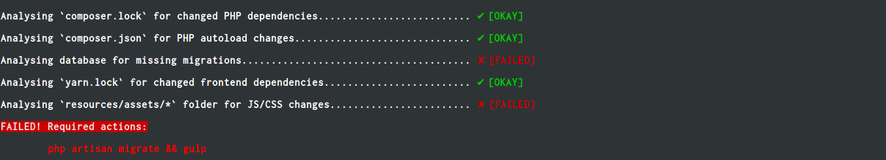

Laravel Informant
================

[](https://travis-ci.org/mcampbell508/laravel-informant)
[](https://packagist.org/packages/mcampbell508/laravel-informant)
[](https://packagist.org/packages/mcampbell508/laravel-informant)
[](https://github.com/mcampbell508/laravel-informant/blob/master/LICENSE)

As applications are always changing with every single pull/merge request that is merged into the main branch, if a team has
several developers, there could be a chance that the local applications for other developers may not reflect the application
state of the latest `master` version.

This package is designed for teams using Laravel and other dependencies such as Node modules - and the aim is to inform
developers about the state of their local application and whether they need to take actions that will help ensure the
application state reflects the latest merged version of an application.



- [Why use this package?](#why-use-this)
- [Installation](#installation)
- [Usage](#usage)
- [Code Style](#code-style)
- [Testing](#testing)
- [Contributing](#contributing)
- [Credits](#credits)
- [License](#license)

Why use this?
------------

Here's a list of what **could** change on every merge:

- `composer.lock` has been modifed, a `composer install` will have to take place.
- `composer.json` has been modified, a `composer dumpauto` might have to take place.
- `package.json` OR `npm-skrinkwrap.json` OR  `yarn.lock` file has been modified, an appropriate command to make sure the frontend dependencies are available.
- Files in `resources/assets` could have been modified, meaning a command like `gulp` might have to be run.
- Database migrations could have been added.

This could help with situations like "My tests pass on CI, but not locally - what can I do?". The first step will probably be making sure the application and all of its dependencies are in sync with the `master` application version.

It is recommended to use this during **local development ONLY**.

Installation
------------

Add the laravel-informant package to your `composer.json` file.

``` json
{
    "require": {
        "mcampbell508/laravel-informant": "1.0.*"
    }
}
```

Or via the command line in the root of your Laravel installation.

``` bash
$ composer require "mcampbell508/laravel-informant:1.0*"
```

Usage
-----

``` php
use MCampbell508\Skeleton;

$skeleton = new Skeleton();
echo $skeleton->echoPhrase('Hello, World!');

```

Code Style
-------

This project follows the following code style guidelines:

- [PSR-2](http://www.php-fig.org/psr/psr-2/) & [PSR-4](http://www.php-fig.org/psr/psr-4/) coding style guidelines.
- Some chosen [PHP-CS-Fixer](https://github.com/FriendsOfPHP/PHP-CS-Fixer) rules.


``` bash
$ php vendor/bin/php-cs-fixer fix
```


Testing
-------

``` bash
$ php vendor/bin/phpunit
```

Contributing
------------

Please see [CONTRIBUTING](https://github.com/mcampbell508/laravel-informant/blob/master/CONTRIBUTING.md) for details.


Credits
-------
- [All Contributors](https://github.com/mcampbell508/laravel-informant/contributors)

License
-------

The MIT License (MIT). Please see [License File](https://github.com/mcampbell508/laravel-informant/blob/master/LICENSE) for more information.
